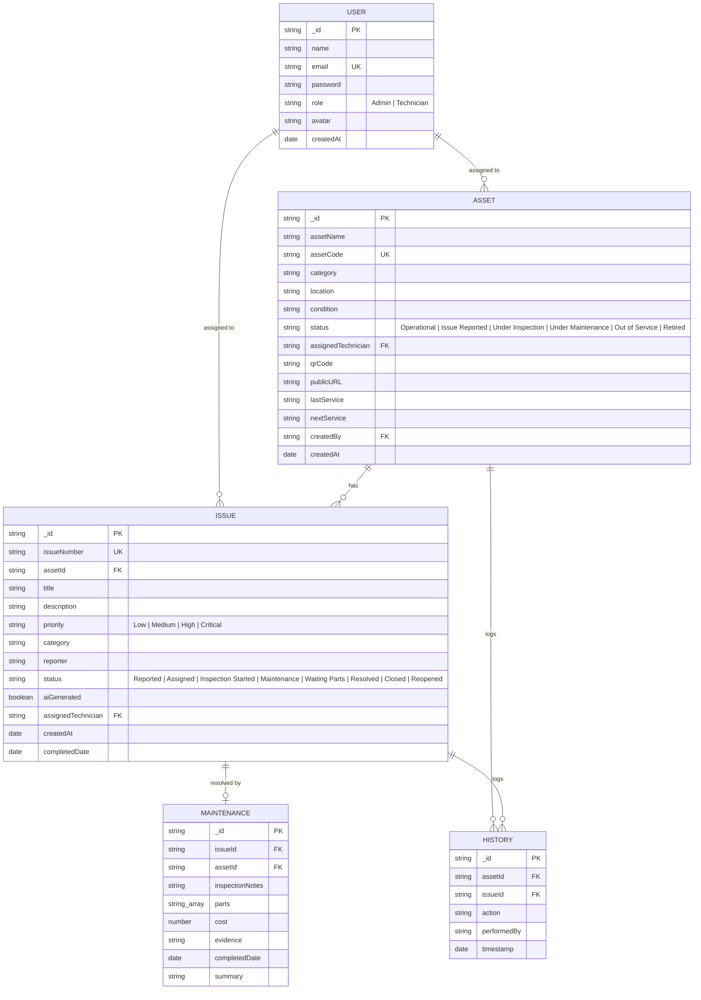

# MaintainIQ

**AI-Powered QR Maintenance & Asset History Platform**
Scan. Report. Diagnose. Maintain.

MaintainIQ gives every physical asset a digital identity: a QR-accessible public page, an issue-reporting workflow, AI-assisted triage, and a permanent service history. Built for schools, hospitals, offices, factories, and facility-management teams who currently track maintenance across registers, phone calls, and spreadsheets.

---

## Architecture

This is an **npm workspaces monorepo** with two independently deployable services:

```
final-hackathon/
├── backend/     — Express API (Node.js, MongoDB, Redis, Cloudinary, Gemini AI)
├── frontend/    — React 19 + Vite SPA (Tailwind CSS v4)
├── package.json — workspace orchestrator (root scripts delegate to both)
├── Dockerfile   — backend-only production image
└── docker-compose.yml — local dev: backend + frontend + Mongo + Redis containers
```

The backend is **API-only** — it does not serve the frontend. In production the two are deployed separately (backend → AWS EC2 behind Nginx/PM2, frontend → S3 + CloudFront), matching `.github/workflows/ci-cd.yml`. The frontend talks to the backend via `VITE_API_URL` (falls back to relative `/api` for same-origin setups).

| Layer | Technology |
|---|---|
| Backend | Node.js, Express, MongoDB (Mongoose), Redis (ioredis, with in-memory fallback) |
| Frontend | React 19, Vite, Tailwind CSS v4 |
| Auth | JWT (httpOnly cookie), bcrypt password hashing, Admin/Technician roles |
| AI | Google Gemini (`@google/genai`) — structured JSON issue triage, maintenance summaries, health scoring |
| Media | Cloudinary (evidence photo uploads) |
| Realtime | Socket.IO — live dashboard/issue-queue updates on create/assign/resolve/reopen/delete |
| Email | Nodemailer (SMTP) — technician notification on issue assignment; logs to console if SMTP is unconfigured |
| Testing | Jest + Supertest — API tests run against the in-memory DB fallback, no external services required |
| Deploy | Docker, GitHub Actions CI/CD, AWS EC2 + PM2 (backend), S3 + CloudFront (frontend) |

---

## Setup

**Prerequisites:** Node.js 22+, npm 10+ (for workspace support). MongoDB/Redis/Cloudinary/Gemini are optional in development — the backend falls back to an in-memory store and mocked AI responses when they're not configured.

```bash
# Install all workspace dependencies (root, backend, frontend) in one pass
npm install

# Configure environment
cp backend/.env.example backend/.env      # fill in Mongo/Redis/Cloudinary/Gemini creds
cp frontend/.env.example frontend/.env    # set VITE_API_URL for your backend

# Run both services in development (two terminals)
npm run dev             # backend  → http://localhost:3000
npm run dev:frontend    # frontend → http://localhost:5173 (proxies to VITE_API_URL)
```

### Tests

```bash
npm test        # runs the backend Jest/Supertest suite (backend/tests/)
```

Tests run against the backend's built-in in-memory DB/cache fallback (`backend/src/config/db.js`, `backend/src/config/cache.js`) — no MongoDB, Redis, or `GEMINI_API_KEY` required. They cover the core issue-reporting flow (`POST /api/issues`, asset-status escalation, validation) and the AI triage endpoint (`POST /api/issues/triage`, including its deterministic fallback response when no Gemini key is configured).

### Production build

```bash
npm run build            # builds frontend/dist then backend/dist
npm start                # runs the compiled backend API (backend/dist/server.js)
```

### Docker (local parity with production topology)

```bash
docker compose up --build
# backend  → http://localhost:3000  (health: /health)
# frontend → http://localhost:5173
```

---

## Demo Credentials

| Role | Email | Password |
|---|---|---|
| Administrator | `admin@maintainiq.com` | `admin123` |
| Technician | `tech@maintainiq.com` | `tech123` |
| Technician (secondary) | `john@maintainiq.com` | `tech123` |

Seeded automatically on first backend startup (see `backend/src/config/db.js`).

---

## Core Workflow

1. **Admin** registers an asset → gets a unique asset code + auto-generated QR code linked to its public page.
2. Anyone scans the QR / opens the public link → sees safe asset info and can **report an issue**.
3. **AI Issue Triage** (Gemini) converts the free-text complaint into a structured title, category, priority, possible causes, initial checks, and safety warnings — reviewable/editable before submission.
4. Asset status escalates automatically (`Issue Reported`, or `Out of Service` for Critical issues).
5. **Admin** assigns the issue to a **Technician**.
6. Technician moves the issue through `Assigned → Inspection Started → Maintenance → Resolved`, recording parts/cost/evidence on resolution (asset status mirrors progress: `Under Inspection` → `Under Maintenance` → back to `Operational`).
7. Every state change writes an immutable **History** record.
8. A resolved/closed issue can be explicitly **reopened** by an Admin if the problem recurs.

### Business rules enforced server-side

- Duplicate asset codes are rejected.
- A Technician may only update/resolve an issue assigned to them; Admins act on any issue.
- A `Closed` issue cannot be edited until reopened.
- Status transitions are validated — an issue can't jump straight from `Reported` to `Resolved` (must go through `/resolve`, which requires inspection notes + a repair summary).
- Maintenance cost cannot be negative.
- An asset's next service date cannot precede its last recorded service date.
- A `Retired` asset cannot have new issues filed against it, and its public page clearly shows the retired state.

---

## Data Model



---

## API Documentation

Interactive Swagger UI is served at:

```
GET /api/docs
```

### Endpoint summary

| Method | Path | Access | Description |
|---|---|---|---|
| POST | `/api/auth/login` | Public | Login, sets httpOnly JWT cookie |
| POST | `/api/auth/logout` | Authenticated | Clears session cookie |
| GET | `/api/auth/me` | Authenticated | Current user profile |
| GET | `/api/auth/technicians` / `/api/technicians` | Authenticated | List technicians |
| GET | `/api/assets` | Authenticated | List/search/filter assets |
| POST | `/api/assets` | Admin | Register asset (generates QR code) |
| GET | `/api/assets/:id` | Authenticated | Asset details |
| PUT | `/api/assets/:id` | Admin | Update asset |
| DELETE | `/api/assets/:id` | Admin | Delete asset (cascades issues/history) |
| GET | `/api/assets/public/:code` | Public | Safe public asset page (QR target) |
| GET | `/api/assets/:id/history` | Authenticated | Asset history timeline |
| GET | `/api/assets/:id/ai-insights` | Authenticated | Health score, risk, preventive recommendation |
| GET | `/api/issues` | Authenticated | List/search/filter issues |
| POST | `/api/issues` | Public (rate-limited) | Report a new issue |
| POST | `/api/issues/triage` | Public (rate-limited) | AI structured issue triage |
| PUT | `/api/issues/:id` | Admin, or assigned Technician | Update status/assignment/details |
| POST | `/api/issues/:id/resolve` | Admin, or assigned Technician | Log maintenance + resolve |
| POST | `/api/issues/:id/reopen` | Admin | Reopen a Resolved/Closed issue |
| DELETE | `/api/issues/:id` | Admin | Delete issue |
| POST | `/api/issues/ai-draft-summary` | Authenticated | AI-polish raw inspection notes |
| GET | `/api/issues/:id/ai-insights` | Authenticated | Similar issues, tech recommendation, estimates |
| GET | `/api/dashboard/stats` | Authenticated | Operational summary metrics |
| POST | `/api/upload` | Authenticated | Upload evidence to Cloudinary |
| GET | `/health` | Public | Health check (ALB/PM2/Docker) |

---

## Deployment

See [DEPLOYMENT.md](DEPLOYMENT.md) for the full AWS EC2 + S3/CloudFront runbook, and `.github/workflows/ci-cd.yml` for the automated pipeline (CI → lint → test → Docker validate → deploy backend to EC2 + deploy frontend to S3/CloudFront).

The CD stage genuinely deploys end-to-end on every push to `main`: `deploy-backend` SSHes into EC2, pulls `main`, rebuilds, reloads PM2, curls `/health` to confirm the new process is live, and auto-rolls back on failure; `deploy-frontend` rebuilds with the production API URL, syncs `frontend/dist/` to S3, and invalidates CloudFront. It requires these repository secrets to be configured to actually run (the jobs are `if: github.ref == 'refs/heads/main'` and will simply not fire without them): `EC2_HOST`, `EC2_USER`, `EC2_SSH_KEY`, `AWS_ACCESS_KEY_ID`, `AWS_SECRET_ACCESS_KEY`, `AWS_REGION`, `S3_BUCKET_NAME`, `CLOUDFRONT_DISTRIBUTION_ID`, `APP_URL`.
